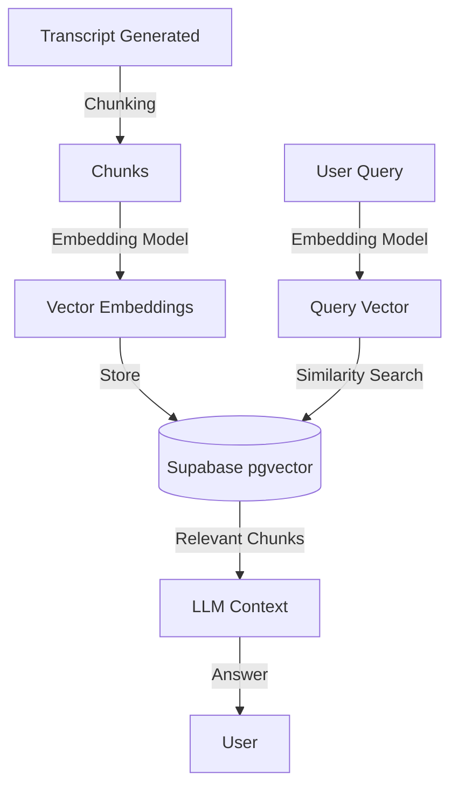

# Feature Spec: v2.1 Chat with Video (RAG)

> **Status**: Planning  
> **Goal**: Enable precise Q&A on long-form videos using Vector Search.

---

## 1. Problem Statement
The current implementation (v2.0) injects the *entire* transcript (truncated to 8000 chars) into the LLM context.
- **Limitation 1**: Fails for videos > 15 minutes (truncation loses data).
- **Limitation 2**: Higher token costs for repetitive questions.
- **Limitation 3**: No "needle in a haystack" retrieval.

## 2. Proposed Solution: RAG (Retrieval Augmented Generation)
Implement a standard RAG pipeline using Supabase `pgvector`.

### 2.1 Architecture



---

## 3. Implementation Steps

### Phase 1: Database & Ingestion
1.  **Enable `pgvector`**: Run SQL migration to enable extension.
2.  **Create `video_chunks` table**:
    ```sql
    create table video_chunks (
      id uuid primary key default uuid_generate_v4(),
      task_id uuid references tasks(id),
      content text,
      chunk_index int,
      embedding vector(1536) -- OpenAI small
    );
    ```
3.  **Update Backend Workflow**:
    -   Add `embed` node after `transcribe`.
    -   Use `langchain.text_splitter` to chunk transcript.
    -   Call OpenAI Embeddings API.
    -   Bulk insert into `video_chunks`.

### Phase 2: Retrieval API
1.  **Create RPC Function**: `match_video_chunks` in Supabase for similarity search.
2.  **Update `/api/chat/route.ts`**:
    -   Detect if `taskId` is present.
    -   If present, embed the `last_user_message`.
    -   Call `rpc('match_video_chunks', { query_embedding, match_threshold: 0.7, limit: 5 })`.
    -   Construct `systemPrompt` using retrieved chunks.

### Phase 3: Frontend UX
1.  **Citation Support**: If possible, return `chunk_index` or timestamps with chunks, so the LLM can cite timestamps (e.g., "According to [05:20]...").
2.  **"Ask about this video"**: Suggest questions based on the summary.

---

## 4. Technical Stack
- **Embeddings**: `text-embedding-3-small` (OpenAI).
- **Vector DB**: Supabase `pgvector`.
- **Orchestration**: LangChain (Python backend for ingestion), AI SDK (Next.js for retrieval).

## 5. Migration Strategy
- New videos get embeddings automatically.
- Old videos: Add a "Re-index" button or background job to backfill embeddings.
