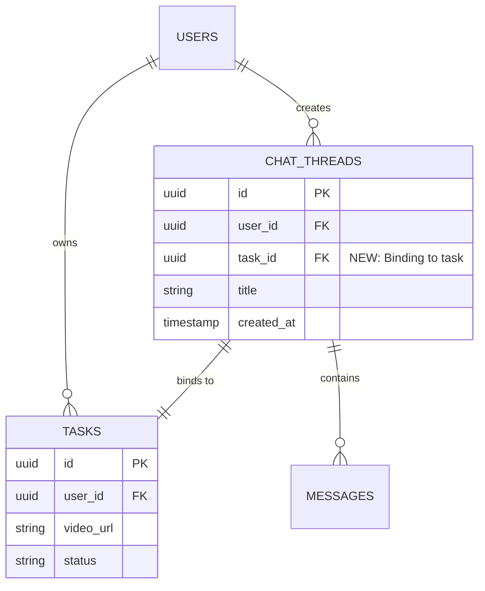

# VibeDigest Chat-First Redesign - Overview

> **Status**: Planning Phase  
> **Last Updated**: 2025-01-18  
> **Version**: 2.0 (Major Redesign)

---

## 🎯 Vision Statement

Transform VibeDigest from a **task-management-centric** application into a **conversation-first knowledge extraction platform**, where AI chat becomes the primary interface for video processing and interaction.

---

## 🔄 Paradigm Shift

### **From (v1.x - Current)**
```
User Flow:
1. Land on Dashboard
2. Submit YouTube URL via form
3. Wait on Task List
4. Click Task Card → View Detail Page
5. Read Summary/Script in tabs
```

**Mental Model**: "Video Processing Queue Manager"

### **To (v2.0 - Target)**
```
User Flow:
1. Land on Chat Interface
2. Paste YouTube URL in conversation
3. AI processes and opens video in side panel
4. Chat with AI about the video content
5. Browse past videos in Library sidebar
```

**Mental Model**: "AI Research Assistant with Video Knowledge"

---

## 📐 Core Architecture Decisions

### 1. **Layout: Split-Screen Workspace**

```
┌─────────────────────────────────────────────────────────┐
│  [☰ Library] VibeDigest               [User Avatar]     │
├───────────────────────┬─────────────────────────────────┤
│                       │                                 │
│   Chat Thread         │   Video Detail Panel            │
│   ┌─────────────┐     │   ┌───────────────────────┐     │
│   │ User: URL   │     │   │  [Video Player]       │     │
│   └─────────────┘     │   └───────────────────────┘     │
│   ┌─────────────┐     │   ┌───────────────────────┐     │
│   │ AI: Card    │────→│   │  Summary | Script     │     │
│   │ [Processing]│     │   │  [Interactive Tabs]   │     │
│   └─────────────┘     │   └───────────────────────┘     │
│   ┌─────────────┐     │                                 │
│   │ User: Q&A   │     │   [Collapse Panel Button]       │
│   └─────────────┘     │                                 │
│                       │                                 │
│   [Input Box]         │                                 │
└───────────────────────┴─────────────────────────────────┘
    60% width (flex-1)      40% width (collapsible)
```

**Desktop (≥1024px)**: Always split-screen  
**Tablet (768-1023px)**: Optional split or full-screen toggle  
**Mobile (<768px)**: Stack layout, video opens in modal

---

### 2. **Data Model: Thread-Task Relationship**

**Rule**: `1 Chat Thread = 1 Task (Video)`



**Implications**:
- When user submits URL in chat → Create Task + Thread simultaneously
- Thread title = Video title (from metadata)
- Library shows all Tasks, clicking opens associated Thread

---

### 3. **Navigation: Chat-Centric**

**New Navigation Structure**:
```
┌─────────────────────────────────────┐
│  Chat (Default Homepage)            │ ← / or /chat
│  ├── Library Sidebar (⌘K)           │ ← Overlay panel
│  └── Video Detail Panel (Context)   │ ← Right panel
└─────────────────────────────────────┘
```

**Removed Pages**:
- ❌ `/dashboard` (replaced by `/chat`)
- ❌ `/tasks/[id]/[slug]` (replaced by chat + panel)

**Retained Pages**:
- ✅ `/settings`
- ✅ `/login`
- ✅ `/` (Landing page for non-authenticated users)

---

### 4. **AI Workflow: Tool-Calling Pattern**

**Implementation**: Vercel AI SDK `tools` parameter

```typescript
// Simplified example
const { messages } = useChat({
  api: '/api/chat',
  tools: {
    process_video: {
      description: 'Process a YouTube video URL',
      parameters: z.object({
        video_url: z.string().url(),
        language: z.string().optional(),
      }),
      execute: async ({ video_url, language }) => {
        // Backend creates Task, starts processing
        return { task_id, status: 'processing' }
      }
    }
  }
})
```

**User Experience**:
1. User: "Summarize https://youtube.com/watch?v=..."
2. AI: Calls `process_video` tool
3. UI: Shows "Processing..." card in chat
4. Backend: Creates Task, runs workflow
5. Realtime: Updates card status → "Completed"
6. UI: Enables "Open Detail Panel" button
7. User: Clicks button → Right panel opens with full video UI

---

### 5. **Library Behavior**

**Trigger**: Button in top-left + Keyboard shortcut (`Cmd+K`)

**UI Pattern**: Slide-out sidebar (similar to VS Code Command Palette)

**Contents**:
- 🕐 Recent Threads (last 10)
- 📚 All Tasks (paginated, searchable)
- 🏷️ Tags/Categories (if implemented)

**Click Action**:
```
User clicks Task in Library
  ↓
Check if Thread exists for this Task
  ↓
If YES: Navigate to Thread, load messages
If NO: Create new Thread, inject Task context as system prompt
  ↓
Open Video Detail Panel with Task data
```

---

### 6. **Multi-URL Handling**

**Detection**: Frontend pre-processes input before sending to AI

```typescript
function detectYouTubeURLs(message: string): string[] {
  const regex = /https?:\/\/(www\.)?(youtube\.com|youtu\.be)\/\S+/g
  return message.match(regex) || []
}
```

**User Flow**:
```
User pastes: "Compare these:
  https://youtube.com/watch?v=A
  https://youtube.com/watch?v=B"

↓ Frontend detects 2 URLs

↓ Show confirmation dialog:

┌─────────────────────────────────────┐
│ Detected 2 video links:             │
│ • Video A (3:45)                    │
│ • Video B (12:30)                   │
│                                     │
│ How should I process them?          │
│ ⚪ Separately (2 threads)            │
│ ⚪ Compare in one conversation       │
│ [Cancel] [Confirm]                  │
└─────────────────────────────────────┘
```

**Backend Handling**:
- **Separately**: Create 2 Tasks + 2 Threads
- **Compare**: Create 2 Tasks, 1 Thread (Thread references both Tasks)

---

## 🎨 Design Principles

1. **Conversation First**: Every action happens through chat dialogue
2. **Context Aware**: Video detail panel follows chat focus
3. **Progressive Disclosure**: Don't show all info upfront, expand on demand
4. **Keyboard Driven**: Power users can do everything via keyboard
5. **Stateful but Stateless**: UI reflects backend state, no optimistic updates

---

## 📊 Success Metrics

**Pre-Launch Validation**:
- [ ] User can submit URL and see video in <10 seconds
- [ ] Chat + Panel loads in <2 seconds (LCP)
- [ ] Library opens in <300ms
- [ ] Mobile UX scores >90 on Lighthouse

**Post-Launch KPIs**:
- **Engagement**: Average messages per session (Target: >5)
- **Retention**: D7 return rate (Target: >30%)
- **Efficiency**: Time from URL submission to first Q&A (Target: <20s)

---

## 🗂️ Document Structure

This redesign is documented across multiple files:

- **00_overview.md** (This file) - High-level vision and decisions
- **01_user_flows.md** - Detailed user journey maps
- **02_technical_architecture.md** - System design and API contracts
- **03_ui_components.md** - Component library and design system
- **04_data_model.md** - Database schema changes
- **05_implementation_plan.md** - Phase-by-phase execution roadmap
- **06_migration_strategy.md** - Backward compatibility and data migration

---

## 🚦 Current Status

- [x] Architecture decisions finalized
- [x] User flows documented
- [ ] Technical specs in progress
- [ ] Implementation pending approval

**Next Steps**: Review this overview, then proceed to detailed technical docs.
