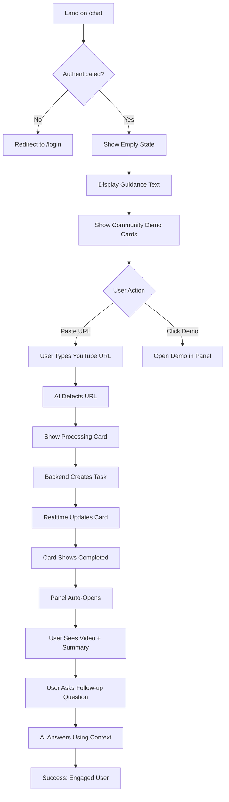
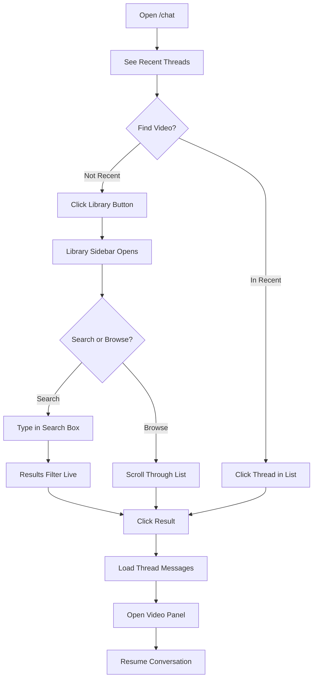
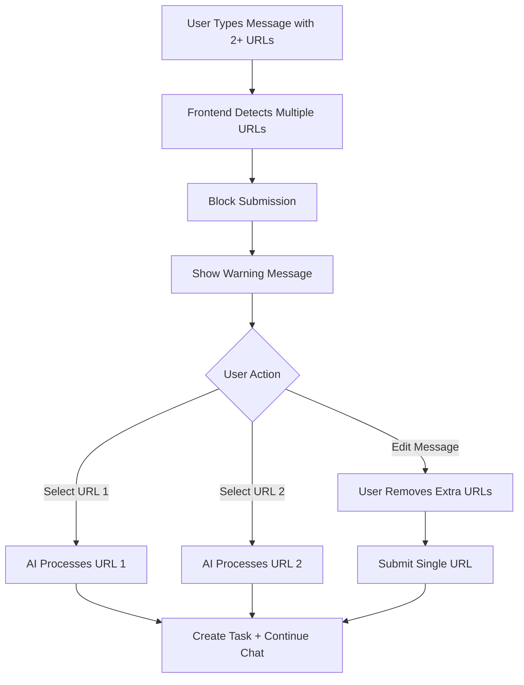
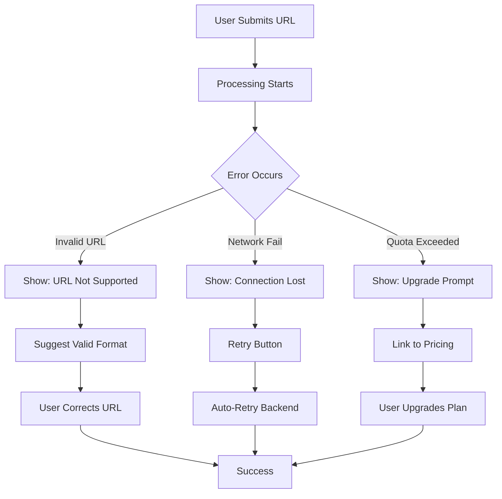
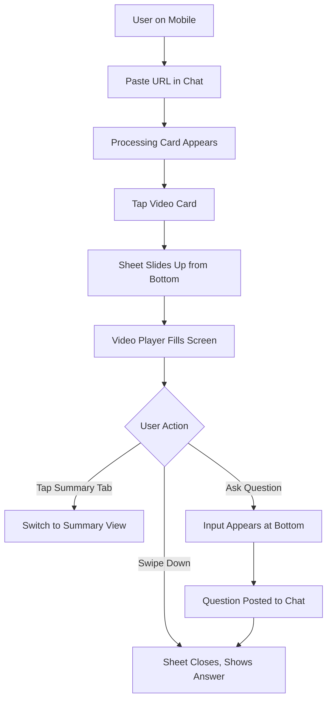

# User Flows

> **Purpose**: Complete user journey maps for v2.0  
> **Format**: Mermaid diagrams + step-by-step descriptions  
> **Last Updated**: 2025-01-18

---

## 🎯 Core User Flows

### Flow 1: New User First-Time Experience

**Goal**: User successfully processes their first video



**Step-by-Step Breakdown**:

1. **Landing** (0s)
   - URL: `/chat`
   - UI: Empty chat with guidance text
   - Action: Read "Paste a YouTube URL to start..."

2. **Discover** (5-10s)
   - UI: Scroll down, see Community Demo Cards
   - Option A: Click demo → Skip to step 7
   - Option B: Paste own URL → Continue to step 3

3. **Submission** (10-15s)
   - User pastes: `https://youtube.com/watch?v=abc123`
   - UI: Input shows URL with preview thumbnail
   - Action: Press Enter or click Send

4. **Processing Starts** (15-16s)
   - AI sends message: "I'll analyze this video for you"
   - UI: Shows processing card with spinner
   - Backend: Creates task, starts workflow

5. **Progress Updates** (16-45s)
   - Card updates: "Downloading... (Step 1/4)"
   - Card updates: "Transcribing... (Step 2/4)"
   - Card updates: "Summarizing... (Step 3/4)"
   - Realtime: Supabase pushes status changes

6. **Completion** (45-50s)
   - Card shows: "✓ Ready"
   - Button appears: "View Summary"
   - Panel auto-opens on right side

7. **Exploration** (50s+)
   - User sees video player + summary tabs
   - User clicks keypoint → Video seeks to timestamp
   - User asks: "What was the main conclusion?"
   - AI responds using summary context

**Success Criteria**:
- ✅ User completes flow in <2 minutes
- ✅ User sends ≥1 follow-up question
- ✅ User doesn't encounter errors

---

### Flow 2: Returning User - Access Past Videos

**Goal**: User finds and reopens a previously processed video



**Step-by-Step**:

1. **Open Chat** (0s)
   - URL: `/chat`
   - UI: Shows last active thread (if any)

2. **Trigger Library** (2s)
   - Click "☰ Library" button (or press `Cmd+K`)
   - Sidebar slides in from left

3. **Find Video** (5-15s)
   - **Option A - Browse**: Scroll through chronological list
   - **Option B - Search**: Type title/keyword
   - List shows: Title + Timestamp + Platform icon

4. **Open** (15s)
   - Click desired video entry
   - Library sidebar closes
   - Thread loads (if exists) OR creates new thread
   - Panel opens with video details

5. **Continue** (20s+)
   - User asks new questions about the video
   - AI has full context from original analysis

---

### Flow 3: Multi-URL Detection & Guidance

**Goal**: User pastes multiple YouTube URLs, system guides them to choose one



**AI Response UI**:
```
┌────────────────────────────────────┐
│ AI (Just now)                      │
│                                    │
│ ⚠️  Multiple URLs Detected         │
│                                    │
│ I can only process one video per   │
│ conversation. Which one would you  │
│ like me to analyze?                │
│                                    │
│ 1️⃣ How AI Works (5:32)             │
│    https://youtube.com/watch?v=A   │
│                                    │
│ 2️⃣ ML Intro (12:15)                │
│    https://youtube.com/watch?v=B   │
│                                    │
│ Reply with 1 or 2, or paste a      │
│ single URL to start fresh.         │
└────────────────────────────────────┘
```

**Alternative: Frontend Prevention**
```
Input Box:
┌────────────────────────────────────┐
│ Paste https://youtube.com/1...     │
│ https://youtube.com/2...           │
│                                  📤│
└────────────────────────────────────┘
                ↓
        (User clicks Send)
                ↓
┌────────────────────────────────────┐
│ ⚠️ Please remove extra URLs        │
│ One video per conversation         │
│                              [OK]  │
└────────────────────────────────────┘
```

---

### Flow 4: Error Recovery

**Goal**: User encounters error, system guides them to recovery



**Error Messages** (User-Friendly):

| Error Type | Message | Recovery Action |
|------------|---------|-----------------|
| Invalid URL | "This doesn't look like a YouTube URL. Try: https://youtube.com/watch?v=..." | Show format example |
| Private Video | "This video is private. Please check the link and try again." | Suggest checking permissions |
| Network Error | "Connection lost. Retrying in 3s..." | Auto-retry 3 times |
| Quota Exceeded | "You've used all 5 free videos this month. Upgrade to Pro?" | Show upgrade CTA |
| Processing Failed | "Something went wrong. Our team has been notified. Try again in a few minutes." | Manual retry button |

---

## 📱 Mobile-Specific Flows

### Flow 5: Mobile Video Viewing



**Mobile Gestures**:
- **Swipe Down**: Close video detail sheet
- **Swipe Left/Right**: Switch between Summary/Script tabs
- **Long Press**: Copy text from summary
- **Double Tap**: Zoom video (if native player)

---

## 🎯 Edge Cases & Alternate Paths

### Edge Case 1: Very Long Video (>2 hours)

**Flow**:
1. User submits 3-hour lecture
2. System detects duration
3. Shows warning: "This video is 3h long. Processing may take 5-10 minutes."
4. User confirms or cancels
5. If confirmed: Show extended progress bar with estimated time

### Edge Case 2: Unsupported Platform

**Flow**:
1. User pastes Vimeo URL (not supported yet)
2. System shows: "Currently only YouTube, Bilibili, and Xiaoyuzhou are supported."
3. Offers: "Request support for Vimeo?"
4. If yes: Opens feedback form

### Edge Case 3: Duplicate URL in Same Thread

**Flow**:
1. User pastes URL already processed in current thread
2. System detects duplicate
3. Shows: "You already analyzed this video in this chat. Would you like to open it again?"
4. If yes: Opens panel without reprocessing

---

## ✅ Flow Validation Criteria

**Each flow should**:
- Have ≤5 user actions to complete
- Provide feedback within 200ms of each action
- Offer clear recovery path for errors
- Work identically on desktop and mobile (except gestures)

**Next**: See `ux/11_wireframes.md` for visual layouts of these flows.
