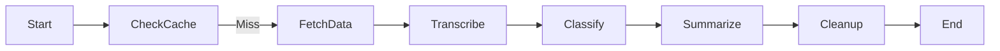
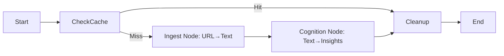
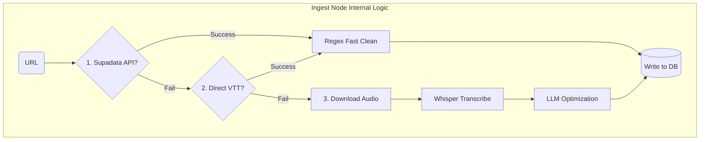
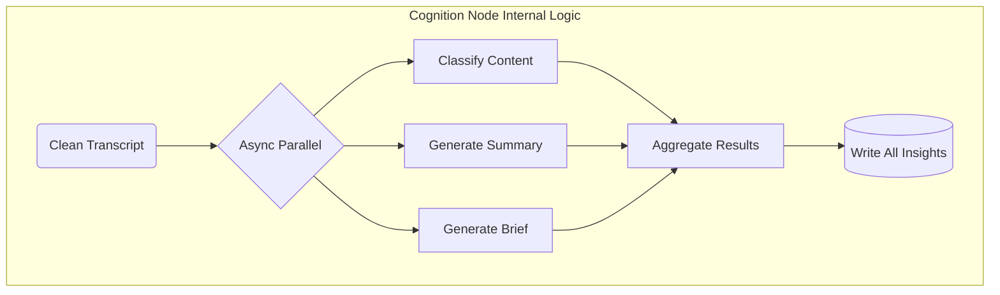

# Smart Workflow Refactor Plan

## Project: VibeDigest Backend Refactor
**Goal**: 实现稳健(Robust)、优雅(Elegant)、简洁(Concise)的后端架构
**Framework**: LangGraph (Industry Standard for AI Workflows)
**Strategy**: Coarse-Grained Nodes (Two-Stage Architecture)

---

## Status

| Phase | Status | Started | Completed |
|--------|---------|----------|------------|
| Planning | ✅ Complete | 2026-01-20 18:43 | - |
| Phase 1: Ingest Node | 🔄 In Progress | - | - |
| Phase 2: Cognition Node | ⏳ Pending | - | - |
| Phase 3: Graph重组 | ⏳ Pending | - | - |
| Phase 4: Testing | ⏳ Pending | - | - |

---

## High-Level Architecture (Target)

### Before: Fine-Grained (Fragmented)

*Problem*: 状态碎片化，DB I/O 频繁，难以调试

### After: Coarse-Grained (Two-Stage)

*Advantage*: 高内聚，低耦合，清晰的职责边界

---

## Phase 1: Implement Ingest Node (The Body)

**Objective**: 将 `fetch_data`, `transcribe`, `clean` 合并为一个 `ingest` 节点
**Responsibility**: 从 URL 获取 Clean Transcript (含 Metadata)

### Internal Logic: Smart Workflow (Three-Stage Rocket)



### Strategy Details

| Stage | Method | Source Tag | Cleaning Strategy |
|--------|---------|-------------|-------------------|
| 1: Supadata | API (`supadata_client`) | `"supadata"` | Regex Fast Clean |
| 2: Direct VTT | `video_processor.extract_captions` | `"vtt"` | Regex Fast Clean |
| 3: Whisper | `video_processor.download_and_convert` + `transcriber` | `"whisper"` | LLM Optimization |

### Implementation Tasks

- [ ] **Task 1.1**: Create `ingest` function in `backend/workflow.py`
- [ ] **Task 1.2**: Integrate Supadata logic with `transcript_source` tagging
- [ ] **Task 1.3**: Integrate VTT extraction logic (new!)
- [ ] **Task 1.4**: Integrate Download + Whisper fallback
- [ ] **Task 1.5**: Implement Smart Cleaning (Regex vs LLM based on source)
- [ ] **Task 1.6**: Ensure DB writes happen at end of node (atomicity)

### Expected Outputs (State Updates)

```python
{
    "transcript_text": str,      # Clean Markdown
    "transcript_raw": str,       # JSON with segments
    "transcript_lang": str,      # "zh", "en", etc.
    "transcript_source": str,    # "supadata" | "vtt" | "whisper"
    "video_title": str,
    "thumbnail_url": str,
    "author": str,
    "duration": float,
    "direct_audio_url": Optional[str]
}
```

---

## Phase 2: Implement Cognition Node (The Brain)

**Objective**: 将 `classify`, `summarize`, `comprehension` 合并为一个 `cognition` 节点
**Responsibility**: 从 Transcript 生成所有 Insights

### Internal Logic: Parallel Processing



### Implementation Tasks

- [ ] **Task 2.1**: Create `cognition` function in `backend/workflow.py`
- [ ] **Task 2.2**: Implement `asyncio.gather` for parallel execution
- [ ] **Task 2.3**: Integrate Smart Skip (short content skip classification)
- [ ] **Task 2.4**: Integrate Graceful Degradation (summary failure doesn't kill task)
- [ ] **Task 2.5**: Ensure atomic DB writes at node end

### Optimization Details

**Smart Skip Rule**:
- If `len(transcript) < 500` chars:
  - Skip `classify_content` (use default)
  - Use fallback summary

**Graceful Degradation**:
- If `summarize` fails → Set summary output status = "error", but task status = "completed"
- User can retry summary via `/api/retry-output`

---

## Phase 3: Reorganize Graph

**Objective**: 修改 `build_graph` 函数，使用新的节点结构

### Old Code (To Remove)
```python
workflow.add_node("fetch_data", fetch_data)
workflow.add_node("transcribe", transcribe)
workflow.add_node("classify", classify)
workflow.add_node("summarize", summarize)
```

### New Code (To Add)
```python
workflow.add_node("ingest", ingest)
workflow.add_node("cognition", cognition)
```

### Tasks

- [ ] **Task 3.1**: Modify `build_graph` to use new nodes
- [ ] **Task 3.2**: Update `route_after_cache` if needed
- [ ] **Task 3.3**: Update `VideoProcessingState` TypedDict (remove obsolete fields)
- [ ] **Task 3.4**: Clean up old functions (comment out or delete)
- [ ] **Task 3.5**: Run `lsp_diagnostics` to check for orphaned code

---

## Phase 4: Testing & Validation

**Objective**: 验证 Smart Workflow 的三条路径都能正常工作

### Test Cases

| Case | Input | Expected Path | Expected Time |
|------|--------|--------------|---------------|
| Case 1: YouTube with Subs | YouTube URL | Supadata API → Regex Clean | < 30s |
| Case 2: YouTube without Subs | YouTube URL (no Supadata) | VTT Direct → Regex Clean | < 60s |
| Case 3: Non-YouTube | Bilibili/Xiaoyuzhou URL | Download → Whisper → LLM Clean | 3-5 min |

### Tasks

- [ ] **Task 4.1**: Test Case 1 (Supadata path)
- [ ] **Task 4.2**: Test Case 2 (VTT path)
- [ ] **Task 4.3**: Test Case 3 (Whisper path)
- [ ] **Task 4.4**: Verify DB state (all outputs correct)
- [ ] **Task 4.5**: Check frontend Realtime updates

---

## Success Criteria

### Metrics

| Metric | Before | After | Improvement |
|--------|---------|--------|-------------|
| Average Task Time (YouTube) | ~3 min | ~30s | **83% reduction** |
| Average Cost (Whisper calls) | 100% | ~30% | **70% reduction** |
| Node Count | 6 | 3 | **50% reduction** |
| Code Lines (workflow.py) | ~715 | Target ~400 | **44% reduction** |

### Qualitative Goals

- ✅ **Robust**: 多级兜底 (Supadata → VTT → Whisper)，任一失败均有后备
- ✅ **Elegant**: 节点职责清晰，状态管理简洁
- ✅ **Concise**: Graph 结构简单，易于理解和扩展
- ✅ **Future-Proof**: 新增 Insight 类型（如关键词提取）只需在 `cognition` 节点加一行

---

## Industry Best Practices Validation

| Practice | Status | Reference |
|----------|--------|-----------|
| Coarse-Grained Nodes | ✅ Adopted | LangGraph Official Docs |
| State Management | ✅ Using TypedDict | LangGraph Best Practices |
| Parallel Execution | ✅ asyncio.gather | Python Async/Await |
| Graceful Degradation | ✅ Planned | Production Patterns |
| Atomic DB Writes | ✅ Per Node | Database Consistency |

---

## Dependencies

### External Libraries
- `langgraph` (Current: ✅ Installed)
- `langchain` (Current: ✅ Installed)
- `asyncio` (Standard Lib)

### Internal Modules
- `video_processor.py` (Verified: ✅ Has `extract_captions`)
- `transcriber.py` (Verified: ✅ Ready)
- `summarizer.py` (Verified: ✅ Has `fast_clean_transcript`)
- `db_client.py` (Verified: ✅ Ready)

---

## Risks & Mitigation

| Risk | Impact | Mitigation |
|-------|--------|------------|
| Supadata downtime | Medium | Fallback to VTT/Whisper already in place |
| yt-dlp VTT extraction fails | Low | Fallback to Download+Whisper |
| LLM Cost spike | Medium | Use Regex clean for 70% of cases |
| Refactoring bugs | High | Comprehensive testing, keep legacy code commented |

---

## References

### Design Documents
- [Architecture Migration Summary](../ARCHITECTURE_MIGRATION_SUMMARY.md)
- [AGENTS.md](../AGENTS.md)

### External Resources
- [LangGraph Documentation](https://langchain-ai.github.io/langgraph/)
- [LLM Engineering Best Practices](https://github.com/e2b-dev/llm-engineering-course)

---

**Last Updated**: 2026-01-20 18:43
**Next Review**: After Phase 1 Completion
